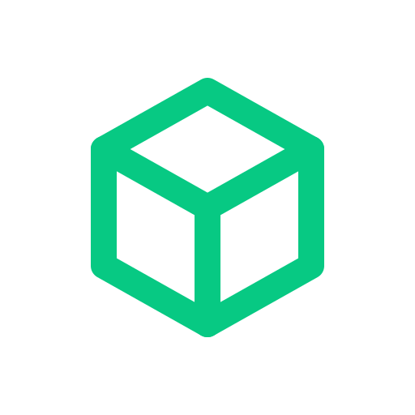

  

<h3 align="center">File storage for AI agents</h3>

  Self-hosted, open-source storage your agents can use over MCP or a plain API key. 
  They upload, manage, and share files — you stay in control.

  <a href="https://stashy.sh">Website</a> ·
  <a href="https://docs.stashy.sh">Docs</a> ·
  <a href="https://github.com/stashysh/stashy">Server</a> ·
  <a href="https://github.com/stashysh/desktop">Desktop</a>

---

- **Agent-native**: built-in MCP server, plus REST and gRPC on one endpoint
- **Any backend**: local disk, S3, R2, MinIO, or GCS
- **Sharing on your terms**: private, team, or public, with clean URLs on your own domain
